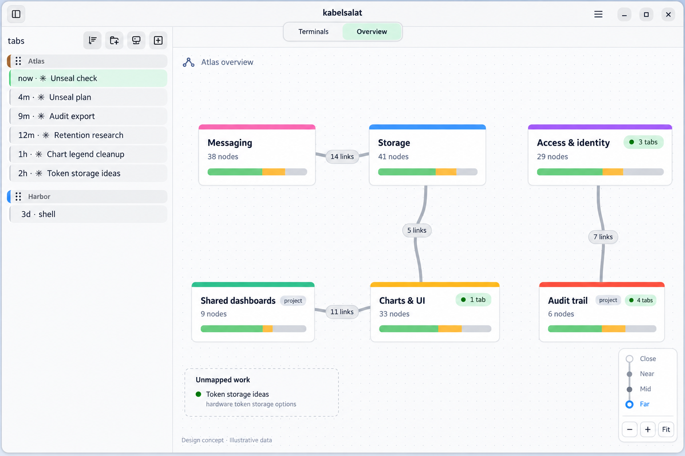
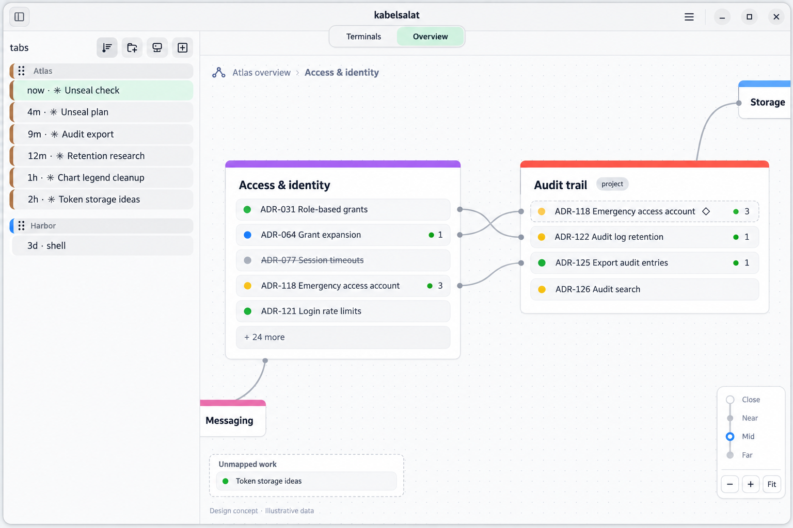
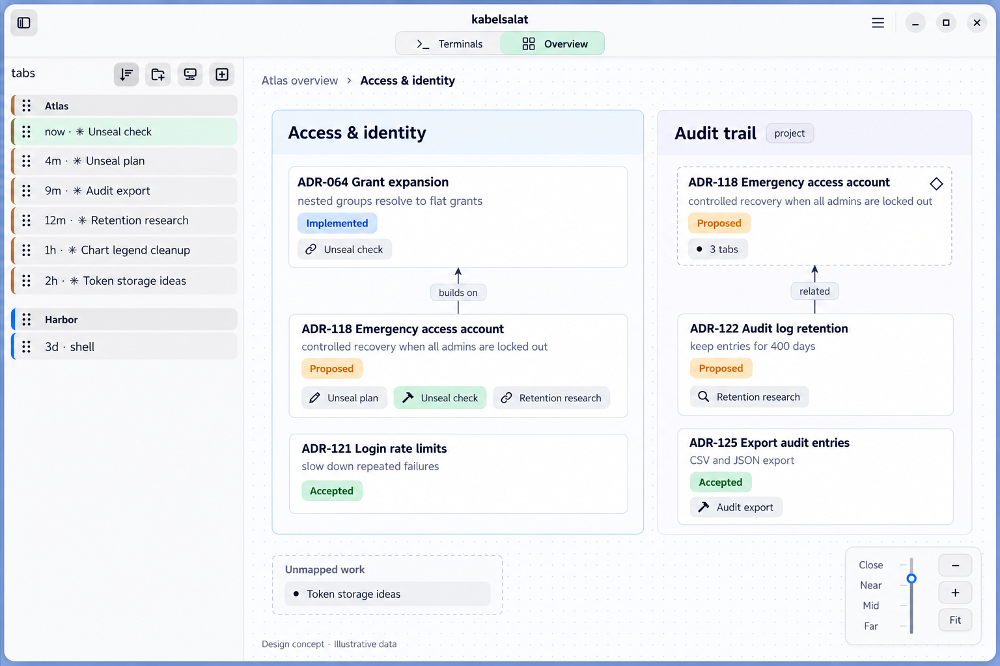
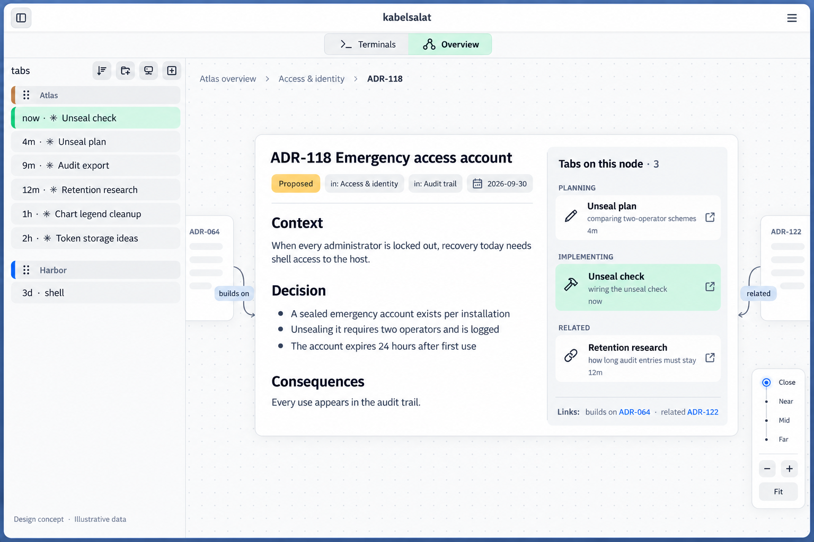

# Overview mode — many tabs per node

2026-10-10. Generated design concepts with fictional data, not screenshots of
shipped behaviour. No spec or ADR exists yet. Second round of the overview-mode
brainstorm, after [the first exploration](../2026-10-10-overview-mode/README.md):
several tabs may work on one node, each with a role the tagger infers
(planning, implementing, researching, related); tabs that match no node land in
an "Unmapped work" tray; zoom is continuous and the tier follows the scale.

All four images share one dataset: group "Atlas" with six agent tabs, three of
them on the same node.

| Image | Focus |
|---|---|
| [01-far.png](01-far.png) | Far: top-level boxes, bundled edges, tab counts only, Unmapped work tray |
| [02-mid.png](02-mid.png) | Mid: child titles as rows with status dot and tab count, unlabelled edges, mirror marker |
| [03-near.png](03-near.png) | Near: cards with summary, status and role-tagged tab chips; selected tab highlighted |
| [04-close.png](04-close.png) | Close: rendered body plus "Tabs on this node", grouped by role, each opens its tab |

What the images do not claim:

- 03 draws drag handles on every sidebar tab and 04 lacks the window
  controls; the sidebar and header stay as they are today.
- 03's zoom handle sits between two tiers; the tier is whichever threshold the
  scale has passed.
- Overlaps are only shown, never flagged: there is no warning marker by design.
- Role icons, colours per kind and the layout are illustrative.
