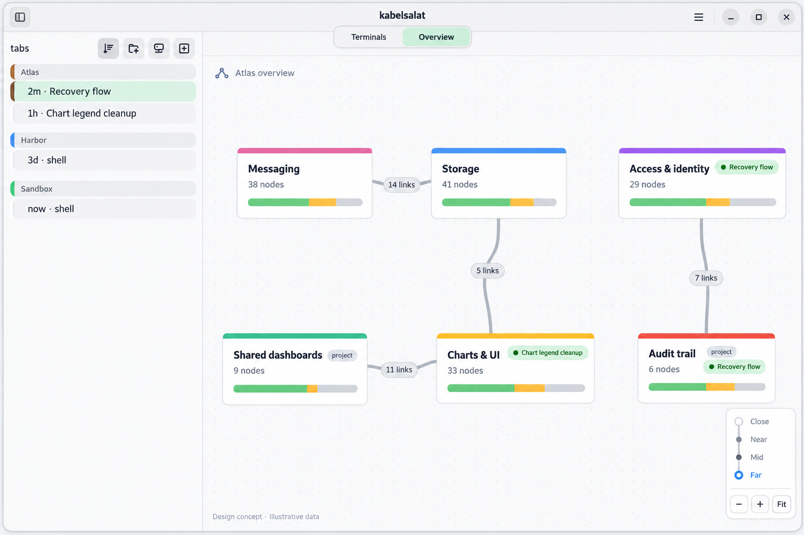
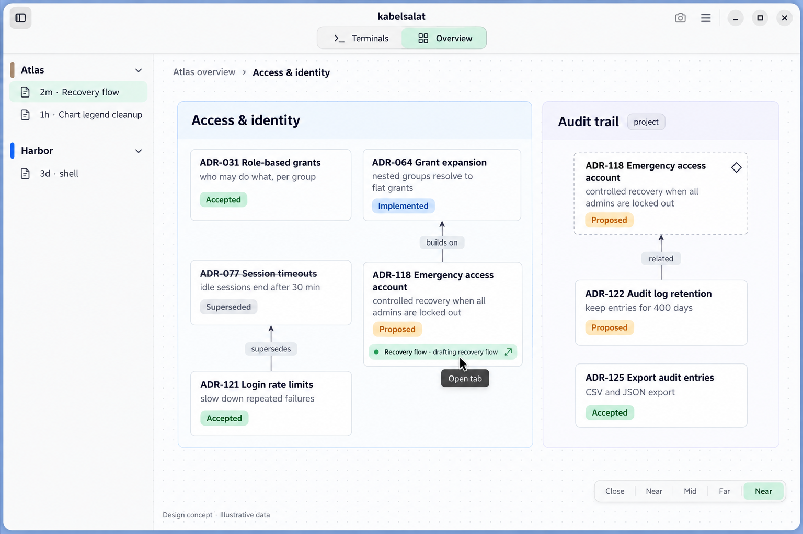
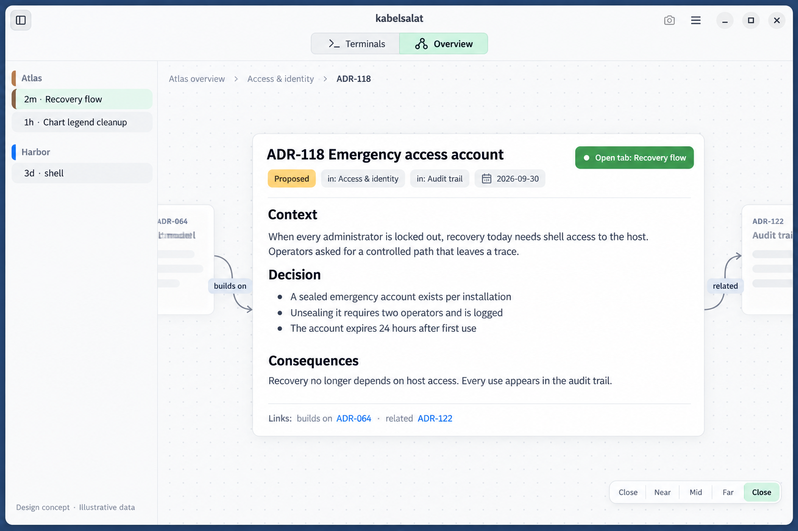

# Overview mode — first exploration

2026-10-10. Generated design concepts with fictional data, not screenshots of
shipped behaviour. No spec or ADR exists yet; these illustrate the brainstorm
for an agent-maintained, per-group overview that replaces the terminal area.

All three images share one dataset: group "Atlas", its overview built from
Markdown nodes with frontmatter (themes, projects, ADRs), tab badges coming
from the tagger.

| Image | Focus |
|---|---|
| [01-far-zoom.png](01-far-zoom.png) | Far tier: top-level nodes with child counts, status bars, bundled edges, live tab badges |
| [02-near-zoom.png](02-near-zoom.png) | Near tier: cards with summary and status, typed edges, a node with two parents drawn as a mirror, badge that opens the tab |
| [03-close-zoom.png](03-close-zoom.png) | Close tier: one node's rendered Markdown body, parents and links, "Open tab" |

What the images do not claim:

- The sidebar in 02 and 03 is drawn differently from the real one; the sidebar
  stays exactly as it is today.
- The zoom control's labels are duplicated in 02 and 03; it is one control
  with four tiers.
- Colours per kind, box sizes and the layout are illustrative; kinds and their
  look are defined by the overview data, not by kabelsalat.
- There is no Mid-tier image.
